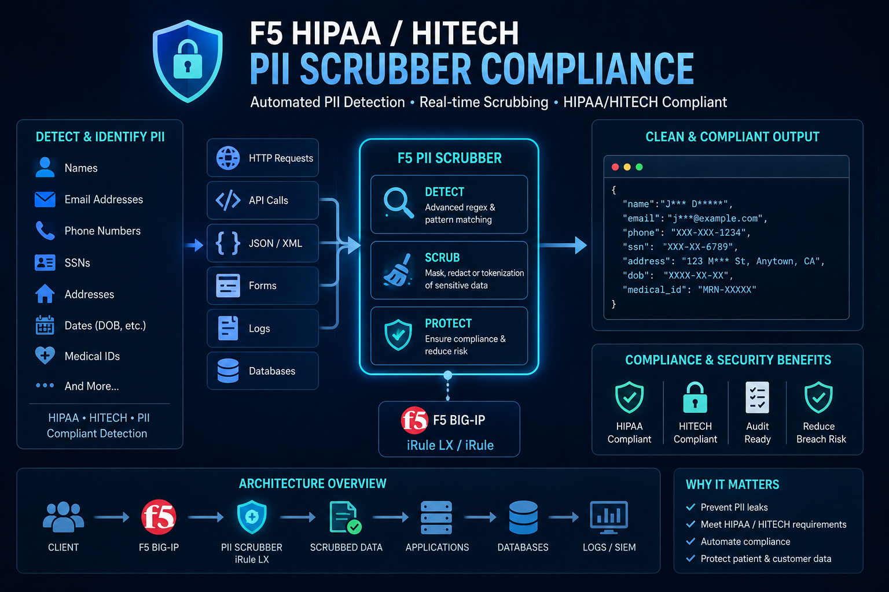

# f5-hipaa-hitech-pii-scrubber-compliance

An F5 BIG-IP iRule that combines **TLS session secret logging** (for offline Wireshark decryption of `tcpdump` captures) with **in-flight PHI scrubbing** of all 18 HIPAA-defined Protected Health Information identifiers, as required by HIPAA (45 CFR §164.514) and the HITECH Act.


---

## ⚠️ Security & Compliance Notice

> This iRule logs TLS pre-master session secrets to `/var/log/ltm`.  
> The resulting `.pms` key file and `.pcap` together allow full traffic decryption.  
> **Treat both files with the same access controls as the raw PHI they protect.**

- Apply this iRule to a Virtual Server **only** for the duration of the capture.
- **Remove it immediately** after the capture is complete.
- Restrict `static::capture_client` to the specific client IP under test; do not leave it set to `"any"` in production.
- The `.pms` file must be deleted after analysis.
- Consult your organization's legal and compliance team before capturing traffic that may contain patient data.

---

## Background

F5 Knowledge Articles referenced:
- **K16700** – Overview of packet tracing with the `ssldump` utility
- **K12783074** – Configuring the BIG-IP system to log SSL/TLS session keys

The iRule implements the NSS Key Log format (`CLIENT_RANDOM`) recognized natively by Wireshark, and also emits the legacy `RSA Session-ID` format for environments using TLS 1.2 with RSA key exchange and session caching enabled.

---

## HIPAA Coverage

The iRule covers all 18 PHI identifiers defined under the **Safe Harbor** de-identification method (45 CFR §164.514(b)(2)):

| # | Identifier | Detection method |
|---|-----------|-----------------|
| 1 | Names | Structured JSON/form field key patterns |
| 2 | Geographic subdivisions < state | ZIP (5/9-digit), street address patterns |
| 3 | Dates (except year) tied to patient | ISO 8601, US MM/DD/YYYY, spelled-out |
| 4 | Phone numbers | Multiple formats incl. +1 country code |
| 5 | Fax numbers | Same pattern as phone |
| 6 | Email addresses | RFC-5321-style pattern |
| 7 | Social Security Numbers | NNN-NN-NNNN and raw 9-digit |
| 8 | Medical Record Numbers | Labeled field patterns (MRN, chart #, patient ID) |
| 9 | Health plan beneficiary numbers | CMS Medicare MBI pattern + labeled member/subscriber IDs |
| 10 | Account numbers | Labeled claim, billing, encounter, and credit card patterns |
| 11 | Certificate / license numbers | Labeled driver's license, state ID, professional license |
| 12 | Vehicle identifiers / VINs | 17-char alphanumeric (excl. I, O, Q) |
| 13 | Device identifiers / serial numbers | MAC addresses (colon/dash), FDA UDI labeled fields |
| 14 | Web URLs with PHI | URLs containing patient/member/record/portal path segments |
| 15 | IP addresses | IPv4 (dotted-quad) and IPv6 |
| 16 | Biometric identifiers | Labeled fingerprint/voiceprint/iris API fields |
| 17 | Full-face photographs | Binary — not regex-scrubable; excluded by content-type filter |
| 18 | Unique healthcare IDs | NPI (10-digit), DEA (2L+7D), EIN (XX-XXXXXXX), ICD-10-CM, CPT, NDC |

> **Note on names (Identifier #1):** Arbitrary human names cannot be reliably detected via regex without high false-positive rates. The iRule targets structured key=value field names in JSON and form-encoded payloads. For FHIR R4/R5 traffic, extend the `re_name` pattern to include `family`, `given`, and `text` field names from the FHIR `HumanName` resource.

---

## Repository Structure

```
f5-hipaa-phi-scrubber/
├── irules/
│   └── hipaa_phi_scrubber.tcl      # The iRule — upload to BIG-IP
├── scripts/
│   ├── capture.sh                  # Start/stop tcpdump on BIG-IP
│   └── extract_session_keys.sh     # Extract .pms key file from /var/log/ltm
├── tests/
│   └── test_phi_patterns.py        # Python unit tests for all regex patterns
├── docs/
│   └── workflow.md                 # Step-by-step operational workflow
├── .gitignore
├── LICENSE
└── README.md
```

---

## Quick Start

### 1. Upload the iRule to BIG-IP

**TMSH:**
```bash
tmsh create ltm rule hipaa_phi_scrubber { <paste contents of irules/hipaa_phi_scrubber.tcl> }
```

**GUI:** Local Traffic → iRules → Create → paste the `.tcl` file content.

### 2. Apply to your Virtual Server (temporarily)

```bash
tmsh modify ltm virtual <vs-name> rules { hipaa_phi_scrubber }
```

### 3. Start the capture

```bash
# On BIG-IP TMOS shell:
bash scripts/capture.sh start -i <client_ip> -o /var/tmp/capture.pcap
```

Or manually:
```bash
tcpdump -nni 0.0:nnn -s0 -w /var/tmp/capture.pcap host <client_ip>
```

### 4. Reproduce your traffic, then stop the capture

```bash
bash scripts/capture.sh stop
```

### 5. Extract TLS session keys

```bash
bash scripts/extract_session_keys.sh -o /var/tmp/session_keys.pms
```

### 6. Remove the iRule from the Virtual Server

```bash
tmsh modify ltm virtual <vs-name> rules { }
```

### 7. Analyse in Wireshark

1. Copy `capture.pcap` and `session_keys.pms` to your workstation.
2. Open `capture.pcap` in Wireshark.
3. Go to **Edit → Preferences → Protocols → TLS**.
4. Set **(Pre)-Master-Secret log filename** to `session_keys.pms`.
5. Traffic decrypts inline. PHI fields in the payload will show `[REDACTED]` tokens.

### 8. Clean up

```bash
rm -f /var/tmp/capture.pcap /var/tmp/session_keys.pms
```

---

## Configuration

Edit the `RULE_INIT` section of the iRule to tune:

| Variable | Default | Description |
|---|---|---|
| `static::capture_client` | `"any"` | Client IP to log TLS secrets for. Set to a specific IP in production. |
| `static::max_collect` | `1048576` (1 MB) | Max payload bytes to collect and scrub per transaction. |

Content types scrubbed on the response side: `text/*`, `*json*`, `*xml*`, `*fhir*`, `*hl7*`, `*form*`. Binary, image, audio, and video types are skipped.

---

## Running the Tests

The Python test suite validates all regex patterns against known-good and known-bad sample strings:

```bash
python3 tests/test_phi_patterns.py -v
```

Tests cover: SSN, phone, email, ISO/US/spelled dates, ZIP, MRN, Medicare MBI, Visa credit cards, VINs, MAC addresses, IPv4, DEA numbers, EINs, ICD-10 codes, NDC codes, and integration tests against a sample FHIR R4 Patient resource.

---

## Limitations

| Limitation | Notes |
|---|---|
| Name detection | Only structured field patterns; free-text clinical notes are not scrubbed |
| Compressed payloads | `Accept-Encoding` is stripped from requests; chunked encoding is handled. Independently compressed content (e.g. pre-compressed files) cannot be scrubbed |
| Binary content | PHI #17 (photos) and binary device data are excluded by content-type filter |
| ICD-10 false positives | Short ICD-10 patterns (e.g. `Z00`) may match unrelated 3-character strings; tune `re_icd10` if needed |
| 9-digit SSN | Raw 9-digit pattern may generate false positives on other numeric IDs; remove from `re_ssn` if not needed |
| Performance | High-volume, large-payload APIs should validate TMM CPU/memory impact before production use |

---

## Legal Disclaimer

This iRule is provided as a **starting point** for HIPAA-compliant packet capture workflows. Regex-based pattern matching cannot guarantee 100% PHI detection across all possible payload formats (free-text clinical notes, non-standard field names, encrypted sub-fields, binary HL7v2, etc.).

**This repository does not constitute legal or compliance advice.** Validate against your specific application traffic and review with your organization's HIPAA Privacy Officer and legal counsel before use in a covered entity or business associate environment.

---

## License

MIT — see [LICENSE](LICENSE).
